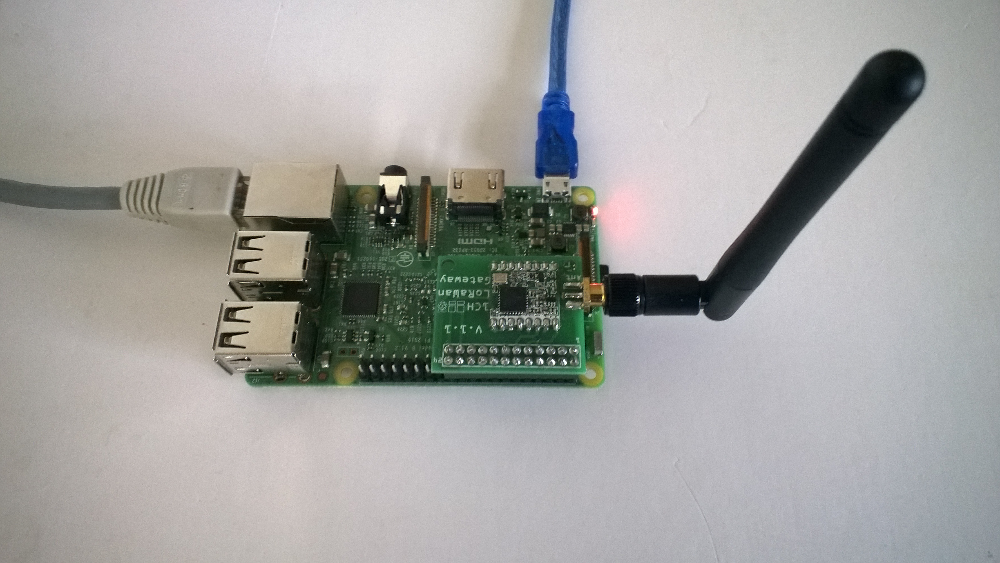

# RFM9XLoRa-Net
A C# library for LoRa[@LoRaAlliance](https://lora-alliance.org/) connectivity for Semtech [@SX127X](https://www.semtech.com/products/wireless-rf/lora-transceivers/SX1276)/HopeRF [@RFMRFM9X](http://www.hoperf.com/rf_transceiver/lora/RFM95W.html) equipped shields on  Windows 10 IoT Core Raspbery PI devices.

The repo has the source code for the series of blog posts written as I built this library

00. ShieldSPI
01. RegisterRead(https://blog.devmobile.co.nz/2018/08/01/rfm95-96-97-98-shield-library-part1/)
02. RegisterScan(https://blog.devmobile.co.nz/2018/08/02/rfm95-96-97-98-shield-library-part2/)
03. RegisterReadAndWrite(https://blog.devmobile.co.nz/2018/08/03/rfm95-96-97-98-shield-library-part3/)
04. TransmitBasic(https://blog.devmobile.co.nz/2018/08/04/rfm95-96-97-98-shield-library-part4/)
05. ReceiveBasic(https://blog.devmobile.co.nz/2018/08/05/rfm95-96-97-98-shield-library-part5/)
06. ReceiveInterrupt(https://blog.devmobile.co.nz/2018/08/06/rfm95-96-97-98-shield-library-part6/)
07. TransmitInterrupt(https://blog.devmobile.co.nz/2018/08/07/rfm95-96-97-98-shield-library-part7/)
08. ReceiveTransmitInterrupt(https://blog.devmobile.co.nz/2018/08/08/rfm95-96-97-98-shield-library-part8/)
09. RefactorRegisterManager(https://blog.devmobile.co.nz/2018/08/09/rfm95-96-97-98-shield-library-part9/)
10. EnumAndMasks(https://blog.devmobile.co.nz/2018/08/23/rfm95-96-97-98-shield-library-part-10/)
11. ReceiveTransmitEvents (https://blog.devmobile.co.nz/2018/08/24/poetry-in-klingon/)
12. ReceiveFifo (https://wordpress.com/view/blog.devmobile.co.nz)
13. Rfm9xLoRaDeviceClient

Rfm9XLoRaDevice

There are also projects for each of the shields

* Dragino(https://blog.devmobile.co.nz/2018/08/01/rfm95-96-97-98-shield-library-part1/)

* Elecrow(https://blog.devmobile.co.nz/2018/08/14/elecrow-lora-rfm95-iot-board-for-rpi/)

* ElectronicTricks(https://blog.devmobile.co.nz/2018/08/15/electronic-tricks-lora-lorawan-shield-for-raspberry-pi-zero-and-pi3/)

* M2M(https://blog.devmobile.co.nz/2018/08/21/m2m-lorawan-gateway-shield-for-raspberry-pi/)

There is also a parallel development project for NetMF which is documented here

My main use case for the Library is a telemetery field gateway uploading data from a number of remote devices.

The code has been tested with shields from [@Dragino ](http://www.dragino.com/products/lora/item/106-lora-gps-hat.html)

The code has been tested with shields from [@ElectronicTracks](https://www.tindie.com/products/electronictrik/loralorawan-shield-for-raspberry-pi-zero-and-pi3)

The code has been tested with shields from [@Elecrow](https://www.elecrow.com/lora-rfm95-iot-board-for-rpi.html)

The code has been tested with shields from [@M2M](https://www.tindie.com/products/m2m/1-channel-lorawan-gateway-shield-for-raspberry-pi/)

The code has been stress/soak tested with a number of clients

Most of my testing has been at 915MHz but I have some 433MHz devices on order. 

